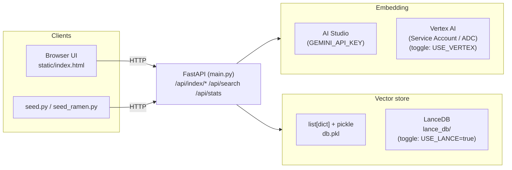

# Cross-Modal Search Demo

[English version is below ↓](#cross-modal-search-demo-english)

Gemini Embedding 2 (`gemini-embedding-2-preview`) を使った、テキストと画像のクロスモーダル検索デモアプリ。BwAI 2026 向け。

## Colab Notebook

[](https://colab.research.google.com/drive/1xYsUFGPLsV-vCqznhTqlwh9pSTi_Yc9W)

## セットアップ

### 前提条件

- Python 3.12+
- [uv](https://docs.astral.sh/uv/)
- [Gemini API キー](https://aistudio.google.com/apikey)

### インストール

```bash
uv sync
cp .env.example .env
# .env を編集して GEMINI_API_KEY を設定
```

## 起動

```bash
uv run uvicorn main:app --reload
```

ブラウザで http://localhost:8000 にアクセス。

## Vertex AI に切り替える（429 対策）

AI Studio の API キー（既定）は **per-minute クォータが ~15 RPM** と厳しく、`seed.py` のような連投で 429 RESOURCE_EXHAUSTED に当たる可能性があります。そのようなクォータにひっかかるような使い方をする場合、 **GCP の Service Account + Vertex AI** に切り替えることで回避できます（クォータが 15 RPM など大きく上がります。こちらの値は著者が個人的に観測している限り、頻繁に変わるので最新情報を確認してください）。

### 1. プロジェクトを用意する

[Cloud Console](https://console.cloud.google.com/projectcreate) で GCP プロジェクトを作る（または既存の物を使う）。**プロジェクト ID** を控える。

### 2. Vertex AI API を有効化する

[Vertex AI API ページ](https://console.cloud.google.com/apis/library/aiplatform.googleapis.com) を開いて「有効にする」をクリック。

### 3. Service Account を作って JSON キーを発行する

[Service Accounts 一覧](https://console.cloud.google.com/iam-admin/serviceaccounts) → **サービスアカウントの作成**:

1. 名前: `vertex-embedding-user` (or 任意の名前)
2. ロール: **Vertex AI User** （`roles/aiplatform.user`）を付与
3. 作成後、その SA を開く → **鍵** タブ → **キーを追加** → **新しい鍵を作成** → **JSON** → ダウンロード
4. JSON ファイルをリポジトリ外の安全な場所に保管（例: `~/keys/vertex-sa.json`）

> 直リンク（プロジェクト固定）: `https://console.cloud.google.com/iam-admin/serviceaccounts?project=<PROJECT_ID>`

### 4. `.env` を編集する

```bash
USE_VERTEX=true
GOOGLE_CLOUD_PROJECT=your-project-id
GOOGLE_CLOUD_LOCATION=us-central1
GOOGLE_APPLICATION_CREDENTIALS=/absolute/path/to/vertex-sa.json
```

`USE_VERTEX=true` が立っていれば API キーは無視され、Vertex AI 経由（ADC 認証）になる。サーバを Ctrl-C で止めて `uv run uvicorn main:app --reload` で再起動。

## Vector DB を LanceDB に切り替える

既定は in-memory `list[dict]` + pickle (`db.pkl`) ですが、永続化と ANN を専用 DB に肩代わりさせたいときは LanceDB に切り替えられます。

```bash
# .env
USE_LANCE=true
```

`USE_LANCE=true` で起動すると、ローカルの `lance_db/` ディレクトリに [LanceDB](https://lancedb.github.io/lancedb/)（Rust 製の埋め込み型ベクトル DB）のテーブルが作られ、追加・検索・統計はすべてそちら経由になります。`db.pkl` には触れません（戻したいときは `USE_LANCE` を外して再起動するだけ）。

uvicorn の起動ログにどちらを使っているかが表示されます。

```
INFO:     Embedding backend: AI Studio (GEMINI_API_KEY)
INFO:     Vector DB: LanceDB (lance_db, 0 items loaded)
```

> 注意: backend を切り替えてもデータの自動移行はしません。LanceDB に切り替えた直後は空インデックスから始まるので、必要に応じて `seed.py` で再投入してください。

## デモデータ投入

サーバー起動中に以下を実行すると、テキスト30件 + 画像20件 = 計50件のデモデータが登録される。

```bash
uv run python seed.py
```

画像は Pillow でグラデーション画像を自動生成する（Sunset, Ocean, Forest, Cherry Blossom など）。

## 使い方

### 1. データ登録

- **テキスト登録**: テキストを入力して「Register Text」をクリック
- **画像登録**: 画像ファイルを選択して「Register Image」をクリック

登録するとインメモリDBに embedding ベクトルが保存される。

### 2. 検索

- **テキスト検索**: 検索クエリを入力して「Text Search」をクリック
- **画像検索**: 画像ファイルを選択して「Image Search」をクリック

テキストで画像を検索したり、画像でテキストを検索するクロスモーダル検索が可能。結果はコサイン類似度の上位3件がカード形式で表示される。

## API

| エンドポイント | メソッド | 説明 |
|---|---|---|
| `/api/index/text` | POST | テキストを登録 (`text` フォーム) |
| `/api/index/image` | POST | 画像を登録 (`file` アップロード) |
| `/api/search` | POST | 検索 (`query_text` or `query_image`) |

## システム構成

Embedding API (AI Studio / Vertex AI) と Vector store (in-memory / LanceDB) はそれぞれ環境変数で切り替えられる構成です。



## 技術構成

- **バックエンド**: FastAPI
- **Embedding**: Gemini Embedding 2 (`gemini-embedding-2-preview`, 3072次元)
- **フロントエンド**: HTML + CSS + vanilla JS
- **ベクトルDB**: インメモリ (list[dict]) もしくは LanceDB (`USE_LANCE=true`)

---
---

# Cross-Modal Search Demo (English)

A cross-modal text-and-image search demo app built on Gemini Embedding 2 (`gemini-embedding-2-preview`). Created for BwAI 2026.

## Colab Notebook

[](https://colab.research.google.com/drive/1xYsUFGPLsV-vCqznhTqlwh9pSTi_Yc9W)

## Setup

### Prerequisites

- Python 3.12+
- [uv](https://docs.astral.sh/uv/)
- [Gemini API key](https://aistudio.google.com/apikey)

### Install

```bash
uv sync
cp .env.example .env
# Edit .env and set GEMINI_API_KEY
```

## Run

```bash
uv run uvicorn main:app --reload
```

Open http://localhost:8000 in your browser.

## Switching to Vertex AI (avoiding 429s)

As of May 14, 2026, the AI Studio API key (default) has a strict **per-minute quota of no more than 10 RPM**, so bursty usage like `seed.py` can hit `429 RESOURCE_EXHAUSTED`. If you expect to push enough traffic to bump into the quota, switch to **GCP Service Account + Vertex AI** for a higher ceiling (around 15 RPM by default — the author has observed this value changing frequently, so check the latest quota information).

### 1. Prepare a project

Create or pick a GCP project in [Cloud Console](https://console.cloud.google.com/projectcreate) and note its **project ID**.

### 2. Enable the Vertex AI API

Open the [Vertex AI API page](https://console.cloud.google.com/apis/library/aiplatform.googleapis.com) and click **Enable**.

### 3. Create a service account and issue a JSON key

Go to [Service Accounts](https://console.cloud.google.com/iam-admin/serviceaccounts) → **Create service account**:

1. Name: `vertex-embedding-user` (or anything you like)
2. Role: grant **Vertex AI User** (`roles/aiplatform.user`)
3. Once created, open the SA → **Keys** tab → **Add key** → **Create new key** → **JSON** → download
4. Store the JSON file somewhere safe outside this repo (e.g. `~/keys/vertex-sa.json`)

> Direct link (project-scoped): `https://console.cloud.google.com/iam-admin/serviceaccounts?project=<PROJECT_ID>`

### 4. Edit `.env`

```bash
USE_VERTEX=true
GOOGLE_CLOUD_PROJECT=your-project-id
GOOGLE_CLOUD_LOCATION=us-central1
GOOGLE_APPLICATION_CREDENTIALS=/absolute/path/to/vertex-sa.json
```

When `USE_VERTEX=true` is set, the API key is ignored and the app talks to Vertex AI via ADC. Stop the server with Ctrl-C and restart it with `uv run uvicorn main:app --reload`.

## Switching the vector DB to LanceDB

The default backend is an in-memory `list[dict]` persisted via pickle to `db.pkl`. If you'd rather offload persistence and ANN to a dedicated DB, you can switch to LanceDB:

```bash
# .env
USE_LANCE=true
```

With `USE_LANCE=true`, a [LanceDB](https://lancedb.github.io/lancedb/) (Rust-based embedded vector DB) table is created in a local `lance_db/` directory, and inserts, search, and stats all flow through it. `db.pkl` is left untouched (just unset `USE_LANCE` and restart to go back).

The active backend is reported in the uvicorn startup log:

```
INFO:     Embedding backend: AI Studio (GEMINI_API_KEY)
INFO:     Vector DB: LanceDB (lance_db, 0 items loaded)
```

> Note: switching the backend does **not** migrate data automatically. Right after flipping to LanceDB you start from an empty index, so re-run `seed.py` if you need demo data.

## Seeding demo data

While the server is running, this registers 30 text items + 20 image items (50 total) as demo data:

```bash
uv run python seed.py
```

Images are gradient PNGs generated on the fly with Pillow (Sunset, Ocean, Forest, Cherry Blossom, etc.).

## Usage

### 1. Register data

- **Register text**: type into the text box and click "Register Text"
- **Register image**: choose an image file and click "Register Image"

Each registration stores an embedding vector in the in-memory DB.

### 2. Search

- **Text search**: type a query and click "Text Search"
- **Image search**: pick an image and click "Image Search"

You can search images with a text query, or search text with an image — cross-modal search. The top 3 results by cosine similarity are shown as cards.

## API

| Endpoint | Method | Description |
|---|---|---|
| `/api/index/text` | POST | Register text (`text` form field) |
| `/api/index/image` | POST | Register an image (`file` upload) |
| `/api/search` | POST | Search (`query_text` or `query_image`) |

## Architecture

The embedding API (AI Studio / Vertex AI) and the vector store (in-memory / LanceDB) can each be flipped at startup via environment variables.


## Tech stack

- **Backend**: FastAPI
- **Embedding**: Gemini Embedding 2 (`gemini-embedding-2-preview`, 3072 dimensions)
- **Frontend**: HTML + CSS + vanilla JS
- **Vector DB**: in-memory (`list[dict]`) or LanceDB (`USE_LANCE=true`)
